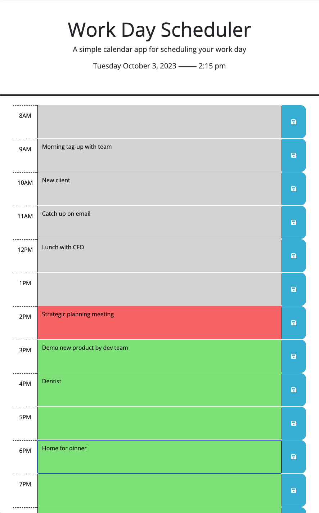
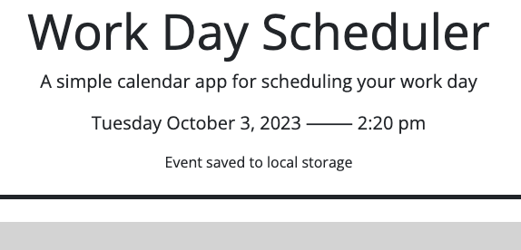

# Work Day Scheduler

## Description 

For this project, I was provided with a basic HTML/CSS framework for a daily schedule and was tasked to add dynamic formatting, updating, and persistent local storage capabilities. There were static example "time blocks" in the provided HTML having different coloring for past, present, and future events, but this formatting needed to be updated continuously based on the current time of day.

This gave me the opportunity to work with Day.js for some basic time and date updating as well as some time comparison functionality for the time-based formatting of the hour blocks.

I decided to build some flexibiltiy into the page by generating and appending the time blocks on page load based on global constants ```firstHour``` and ```lastHour```. If the first and last hours are modified, then different time blocks will be generated. This gave me an opportunity to learn more about jQuery methods to create page elements, add element classes and other necessary attributes, and append the new elemenets to the page. I also had to use jQuery methods to traverse the DOM and delegate events such as button clicks coming from dynamically generated buttons. I am happy with the result.

One issue raised by the potential changing of first and last hours was the persistent storage of event data. If the scheduler hours are modified, the page structure will not match the event variable loaded from local storage. I had to create some conditional checks to determine if there was a mismatch and then use a temp variable to retain any existing events that fell within the new schedule interval before removing the mismatched data from local storage and reinitializing the object variable.

```javascript
// check if the myEvents on local storage doesn't match the code assumptions
// this could occur because the firstHour or lastHour global variables were changed
var numberOfHours = lastHour - firstHour + 1;
if (Object.keys(myEvents).length != numberOfHours ||
    Object.keys(myEvents)[0] != firstHour ||
    Object.keys(myEvents)[numberOfHours-1] != lastHour) {
  
  // save what was retrieved from localStorage to retain any existing event descriptions
  var tempEvents = myEvents;

  // clear the item from localStorage and reinitialiaze the object variable and the localStorage item
  localStorage.removeItem(myEventsStringify);
  initializeMyEvents();
  // copy all existing events during the new schedule interval from tempEvents into myEvents
  for (var i = firstHour; i < lastHour + 1; i++) {
    if (tempEvents[i]) {
      myEvents[i] = tempEvents[i];
    }
  }
}
```
This built-in flexibilty will allow for a simple future expansion providing the user direct access to the start and end hours, enhancing the usability of the application.


In this project I learned that fundamental decisions in how the application is built could allow for simple future expansion or alternatively could severely hamper any modification or improvement down the road. Program architecture is a fundamental consideration, and potential future development should be considered in the beginning stages so that desired future growth is not unnecessarily limited.

I deployed the application on [GitHub](https://github.com/) [Pages](https://pages.github.com/), and it can be found [here](https://d-a-v-i-d-w-r-i-g-h-t.github.io/work-day-scheduler/).


## Installation

N/A


## Usage 

The following is a screenshot of the Work Day scheduler.

On page load, the Work Day Scheduler attempts to retrieve events from local storage. If there are no stored events, the scheduler is loaded with blank entry fields. A number of hourly time blocks are then generated and appended to the page based on global constants ```firstHour``` and ```lastHour```. Although not directly modifiable by the user, the code is built with the future option available.



Below the title and welcome message, the current date and time are displayed, automatically updated every minute. Additionally, color formatting is dynamically applied to the hourly time blocks based on the current time. The current hour is highlighted red, hours in the past are gray, and hours in the future are green. The same one-minute update frequency appiles to this formatting as well.

Any time block can be clicked on for user entry of an event description. If the user clicks the save icon on the right side of the time block, that event description will be saved to local storage and will persist between sessions. Upon save, a save notification message is displayed to the user in the header below the date, as shown below:




## Credits

I read the [Day.js](https://day.js.org/en/) documentation to learn about time and date [formatting](https://day.js.org/docs/en/display/format).

I learned further details of ```localStorage``` at [mdn web docs](https://developer.mozilla.org/en-US/), [Web Storage API](https://developer.mozilla.org/en-US/docs/Web/API/Web_Storage_API).

I learned about working with textareas from [TutorialRepublic](https://www.tutorialrepublic.com/), [How to get the value of a textarea in jQuery](https://www.tutorialrepublic.com/faq/how-to-get-the-value-of-a-textarea-in-jquery.php).


## License

Please refer to the LICENSE in the repo.

---
